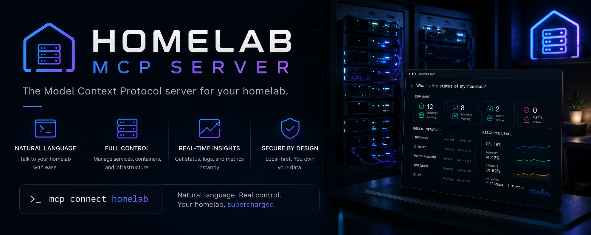

# homelab-mcp

[](https://github.com/Nainounen/homelab-mcp/actions/workflows/ci.yml)
[](https://www.npmjs.com/package/homelab-mcp)
[](https://opensource.org/licenses/MIT)
[](https://nodejs.org/)

<br>



MCP server that gives AI assistants full control of a Proxmox homelab — manage VMs and containers, deploy Docker projects, monitor services, control the media stack, and check storage health, all from conversation.

**65+ tools across 17 domains.** Modular architecture designed for AI-assisted extensibility.

## AI Setup

**No manual config needed.** The server includes an AI-native setup wizard. Just connect it to your MCP client and say:

> "Set up my homelab" or "Configure the MCP server"

The setup wizard scans your configuration, guides you through each setting interactively, saves your answers, and verifies connectivity — all through conversation. Credentials are never exposed to the AI; the wizard masks passwords, API keys, and tokens before returning any results.

## Quick start

### Prerequisites
- **Node.js 20+**
- A Proxmox VE host reachable over the network
- A devbox (any SSH-accessible Linux host running Docker)
- (Optional) Media services: Plex, Radarr, Sonarr, SABnzbd, Overseerr, Prowlarr
- (Optional) Monitoring: Prometheus, Grafana, Uptime Kuma

### Install

**From npm (recommended):**
```bash
npm install -g homelab-mcp
# Or locally in your project:
npm install homelab-mcp
```

**From source (for contributors):**
```bash
git clone https://github.com/Nainounen/homelab-mcp.git
cd homelab-mcp
npm install
npm run build
```

### Docker (optional)

A Dockerfile is provided for containerized deployments:

```bash
npm run build
cp .env.example .env   # edit with your credentials
docker compose up -d
```

For most users, running directly with Node.js (no Docker) is simpler — the MCP server communicates over stdio.

### Connect to your MCP client

Add to your MCP client's config file. For Claude Code, that's `~/.claude/claude_mcp_config.json`:

```json
{
  "mcpServers": {
    "homelab": {
      "command": "npx",
      "args": ["homelab-mcp"],
      "cwd": "/path/to/your/homelab-config"
    }
  }
}
```

Place your `.env` file in the `cwd` directory (copy `.env.example` from this repo as a starting point). No secrets go in the MCP config — the server loads `.env` from its working directory.

Then just say **"set up my homelab"** — the AI-native setup wizard will guide you through the rest.

## Configuration

All settings live in `.env`. See `.env.example` for the full template. The server starts with the services you configure — any service whose env vars are missing is skipped with a warning.

### Required (server won't start without these)

| Variable | Description |
|---|---|
| `PROXMOX_HOST`, `PROXMOX_PORT`, `PROXMOX_USER`, `PROXMOX_NODE` | Proxmox API access |
| `PROXMOX_PASSWORD` or `PROXMOX_KEY_PATH` | Proxmox auth |
| `DEVBOX_HOST`, `DEVBOX_USER` | Devbox SSH access |
| `DEVBOX_PASSWORD` or `DEVBOX_KEY_PATH` | Devbox SSH auth |
| `RADARR_URL`, `RADARR_API_KEY` | Radarr API |
| `SONARR_URL`, `SONARR_API_KEY` | Sonarr API |
| `PROWLARR_URL`, `PROWLARR_API_KEY` | Prowlarr API |
| `SABNZBD_URL`, `SABNZBD_API_KEY` | SABnzbd API |
| `OVERSEERR_URL`, `OVERSEERR_API_KEY` | Overseerr API |

### Optional (skipped with a warning if missing)

| Variable | Service |
|---|---|
| `QNAP_HOST`, `QNAP_USER`, `QNAP_PASSWORD` or `QNAP_KEY_PATH` | QNAP NAS |
| `PLEX_URL`, `PLEX_TOKEN` | Plex |
| `TAUTULLI_URL`, `TAUTULLI_API_KEY` | Tautulli analytics |
| `BAZARR_URL`, `BAZARR_API_KEY` | Bazarr subtitles |
| `ADGUARD_URL`, `ADGUARD_USER`, `ADGUARD_PASSWORD` | AdGuard Home |
| `PBS_URL`, `PBS_TOKEN_ID`, `PBS_TOKEN_SECRET` | Proxmox Backup Server |
| `LIDARR_URL`, `LIDARR_API_KEY` | Lidarr music |
| `READARR_URL`, `READARR_API_KEY` | Readarr books |
| `UPTIME_KUMA_URL`, `UPTIME_KUMA_USER`, `UPTIME_KUMA_PASSWORD` | Uptime Kuma |
| `PROMETHEUS_URL` | Prometheus API |
| `GRAFANA_URL`, `GRAFANA_TOKEN` | Grafana API |
| `TELEGRAM_BOT_TOKEN`, `TELEGRAM_CHAT_ID` | Telegram notifications |

### Security settings

| Variable | Default | Description |
|---|---|---|
| `SSH_STRICT_HOST_KEY` | `false` | Set to `true` to enable `known_hosts` verification |
| `PROXMOX_TLS_VERIFY` | `false` | Set to `true` to validate Proxmox TLS certificates |
| `PBS_TLS_VERIFY` | `false` | Set to `true` to validate PBS TLS certificates |

### Tuning

| Variable | Default | Description |
|---|---|---|
| `MAX_OUTPUT_CHARS` | `30000` | Max characters per tool result before truncation (`0` disables) |
| `HTTP_RETRIES` | `3` | Retries for transient HTTP failures (`0` disables) |
| `DEVBOX_CMD_TIMEOUT` | `30000` | Devbox SSH command timeout in ms |
| `PROXMOX_CMD_TIMEOUT` | `60000` | Proxmox SSH command timeout in ms |

## Tools reference

### Infrastructure

| Tool | Description |
|---|---|
| `proxmox_list_nodes` | List Proxmox nodes with CPU, RAM, uptime |
| `proxmox_list_vms` | List all VMs and LXC containers |
| `proxmox_start_vm` | Start a VM or container |
| `proxmox_stop_vm` | Stop a VM or container |
| `proxmox_restart_vm` | Restart a VM or container |
| `proxmox_get_metrics` | Detailed metrics for one VM/CT |
| `proxmox_get_node_metrics` | Node-level CPU, RAM, disk, load |
| `proxmox_create_ct` | Create a new Debian 12 LXC container |
| `proxmox_get_logs` | Tail task log for a VM/CT |
| `proxmox_exec` | Run a shell command on Proxmox host (dangerous commands blocked) |

### Devbox & Docker

| Tool | Description |
|---|---|
| `devbox_exec` | Run a shell command on the devbox (dangerous commands blocked) |
| `devbox_read_file` | Read a file (max 100 KB) |
| `devbox_write_file` | Write a file, auto-creates parent dirs (max 1 MB) |
| `devbox_list_dir` | List directory contents |
| `devbox_docker_ps` | Show running Docker containers |
| `devbox_docker_compose` | Run compose up/down/restart/pull/logs |
| `devbox_git` | Git status, pull, log, or clone a repo |
| `devbox_project_deploy` | Deploy: git pull → compose pull → compose up → status |
| `devbox_project_status` | Health check for a deployed project |
| `devbox_project_list` | Scan a base path for compose projects |

### Media — download & library

| Tool | Description |
|---|---|
| `radarr_search_movie` | Search for a movie by title |
| `radarr_add_movie` | Add a movie and trigger download search |
| `radarr_list_movies` | List movies with download status (filter/search/limit) |
| `radarr_remove_movie` | Remove a movie (optionally delete files) |
| `radarr_get_queue` | Active movie downloads with progress |
| `radarr_force_search` | Re-search indexers for a movie |
| `radarr_get_history` | Recent download history |
| `radarr_check_releases` | Show available releases and rejections |
| `radarr_clear_queue` | Remove all items from download queue |
| `radarr_clear_blocklist` | Clear the release blocklist |
| `radarr_blocklist_release` | Blocklist a bad release and retry |
| `radarr_list_path_mappings` | List remote path mappings |
| `radarr_set_path_mapping` | Add/update a path mapping |
| `sonarr_search_series` | Search for a TV series by title |
| `sonarr_add_series` | Add a series and trigger download |
| `sonarr_list_series` | List series with episode progress (filter/search/limit) |
| `sonarr_remove_series` | Remove a series (optionally delete files) |
| `sonarr_get_queue` | Active episode downloads with progress |
| `sonarr_force_search` | Re-search for missing episodes |
| `sonarr_season_search` | Search for a specific season |
| `sonarr_check_releases` | Show releases and rejections for a season |
| `sonarr_blocklist_release` | Blocklist and retry a failed download |
| `sonarr_clear_queue` | Clear the download queue |
| `sonarr_clear_blocklist` | Clear the release blocklist |
| `sonarr_list_path_mappings` | List remote path mappings |
| `sonarr_set_path_mapping` | Add/update a path mapping |
| `sabnzbd_get_status` | Download speed, ETA, disk space, queue size |
| `sabnzbd_list_queue` | Active NZB downloads with progress |
| `sabnzbd_get_history` | Recent download history |
| `sabnzbd_pause_queue` | Pause downloads |
| `sabnzbd_resume_queue` | Resume downloads |
| `sabnzbd_delete_item` | Delete a queue item by NZO ID |
| `prowlarr_list_indexers` | List indexers with status |
| `prowlarr_sync_apps` | Sync indexers to Radarr/Sonarr |
| `prowlarr_test_indexers` | Test all (or one) indexer |
| `lidarr_search_artist` | Search for a music artist |
| `lidarr_add_artist` | Add an artist to Lidarr |
| `lidarr_list_artists` | List all artists with album counts |
| `lidarr_remove_artist` | Remove an artist |
| `lidarr_get_queue` | Active music downloads |
| `readarr_search_book` | Search for a book |
| `readarr_add_book` | Add a book to Readarr |
| `readarr_list_books` | List all books |
| `readarr_get_queue` | Active book downloads |

### Media — Plex & requests

| Tool | Description |
|---|---|
| `plex_get_libraries` | List Plex libraries with item counts |
| `plex_search` | Search across all libraries |
| `plex_get_sessions` | Who is streaming, what, transcode/direct play |
| `plex_recently_added` | Recently added movies and episodes |
| `plex_refresh_library` | Trigger a library scan |
| `plex_delete_media` | Permanently delete by ratingKey |
| `plex_get_watch_history` | Recent watch history across users |
| `seerr_list_requests` | List media requests from family |
| `seerr_approve_request` | Approve a pending request |
| `seerr_decline_request` | Decline a request |
| `seerr_delete_request` | Delete a request |
| `seerr_stats` | Request statistics |
| `tautulli_get_activity` | Current Plex streams (Tautulli) |
| `tautulli_get_history` | Plex watch history (Tautulli) |
| `tautulli_get_stats` | 30-day play stats |
| `bazarr_status` | Wanted subtitle counts |
| `bazarr_download_subtitle` | Trigger manual subtitle download |

### Media — operational

| Tool | Description |
|---|---|
| `media_status` | Running container status and uptime |
| `media_logs` | Tail logs for a media container |
| `media_restart` | Restart a media container |
| `media_dashboard` | All-in-one: Proxmox, containers, downloads, library, storage, GPU |
| `nvidia_status` | GPU temp, util, VRAM, power |
| `security_status` | SSH config and Proxmox firewall status |

### Monitoring & observability

| Tool | Description |
|---|---|
| `prometheus_snapshot` | Quick CPU, RAM, disk, network, container health |
| `prometheus_query` | Run an arbitrary PromQL query |
| `prometheus_range_query` | Historical metric trends |
| `grafana_list_dashboards` | List all dashboards |
| `grafana_get_dashboard` | Get panel list for a dashboard |
| `grafana_query_panel` | Query actual data from a panel |
| `uptime_status` | Monitor up/down status and latency |

### Storage, network & DNS

| Tool | Description |
|---|---|
| `qnap_status` | QNAP NAS: RAID, drive temps, storage |
| `qnap_disk_health` | SMART health per drive |
| `qnap_storage_usage` | Per-share usage and LVM |
| `qnap_raid_status` | RAID array health check |
| `pbs_status` | PBS datastore usage |
| `pbs_list_snapshots` | Recent backup snapshots |
| `pbs_get_tasks` | Backup/verify/GC task history |
| `adguard_stats` | DNS query stats and block rate |
| `adguard_check_host` | Check if a domain is blocked |
| `adguard_toggle_protection` | Enable/disable DNS filtering |
| `wol_send` | Wake-on-LAN magic packet |
| `tailscale_status` | Tailscale peers and status |

### Updates, notifications & meta

| Tool | Description |
|---|---|
| `container_check_updates` | Check for newer Docker images |
| `container_update` | Pull + restart a container |
| `notify_telegram` | Send a message to Telegram |
| `homelab_health` | Ping all configured services, report reachable/down + latency |
| `homelab_capabilities` | **Start here** — lists all available tools |
| `homelab_setup` | **AI-guided setup wizard** — configure `.env` through conversation |

## Architecture

```
src/
├── {service}.ts          # Layer 1: HTTP/SSH client factory
├── tools/{service}.ts    # Layer 2: Zod schemas + implementations
├── modules/{service}.ts  # Layer 3: Tool definitions + handler router
├── modules/registry.ts   # Central module registry
└── index.ts              # MCP server entry point
```

Each integration follows the same three-file pattern. Adding a new service means creating these three files and registering it in the registry. The scaffolding script handles the boilerplate:

```bash
npm run new-module -- tautulli
```

See [CONTRIBUTING.md](CONTRIBUTING.md) for the full guide.

## Security

- **Credentials**: All secrets live in `.env`, which is gitignored. Never commit it.
- **SSH host keys**: Verification is off by default (homelab hosts change keys often). Set `SSH_STRICT_HOST_KEY=true` to enable it.
- **TLS**: Proxmox/PBS self-signed certs — verification off by default. Set `PROXMOX_TLS_VERIFY=true` / `PBS_TLS_VERIFY=true` if you have trusted certs.
- **Command safety**: `exec` tools block destructive commands (`rm -rf /`, `mkfs`, `shutdown`, etc.).
- **Error sanitization**: Error messages returned to the MCP client are sanitized — full details go to stderr.

See [SECURITY.md](SECURITY.md) for details.

## License

MIT — see [LICENSE](LICENSE).
